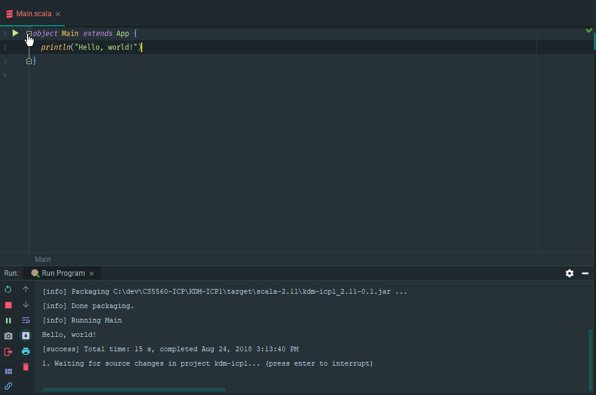

# KDM-ICP1
CS5560 Knowledge Discovery Management - In Class Programming 1

# Hello Scala
This ICP is intended to setup our development environment for use with IntelliJ IDE and the Scala programming language. To demonstrate correct installation, a Hello World program was created using Scala.

---
