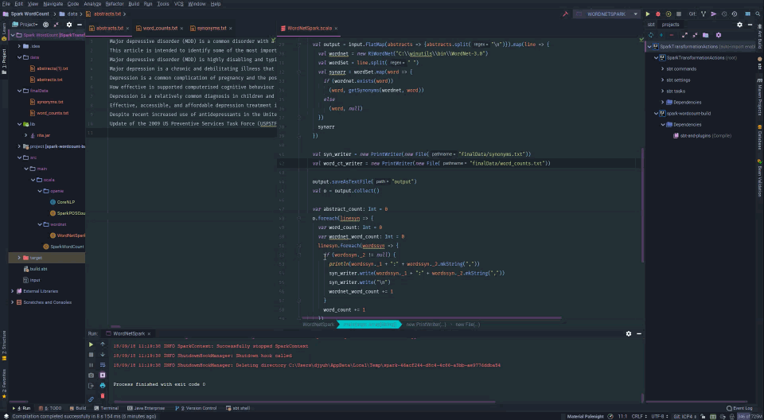
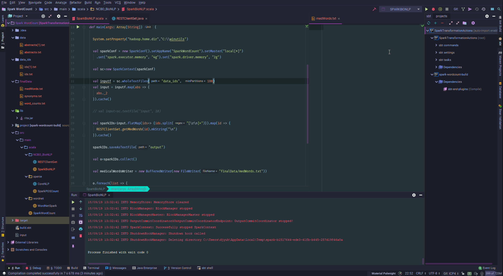

# KDM-ICP4

CS5560 Knowledge Discovery Management - In Class Programming 4

# Introduction

This ICP requires utilizing Spark to perform data statistics upon the 10 abstracts that were extracted in the previous ICPs.

# Get Noun and Verb Count

To get the noun and verb count using Spark, the scala code was modified to incorporate a java file for obtaining the NLP to get the parts-of-speech of the abstracts. This java file, `CoreNLP.java` was used to house the methods of `returnSentences(String text)` and `returnPOS(List<CoreMap> text)` . These methods were used to extract the sentences and parts of speech after performing flatmap and map changes on the abstracts.

# Get WordNet Word Count

To get the word count from WordNet, the library for Rita was imported. In the `WordNetSpark.scala` filethe abstracts were collected as wholeTextFiles and flatmap was done to flatten the abstracts' contents. From here, WordNet was used to obtain the synonyms.

If no synonyms were found using WordNet then the associated value is `null`. Using this, the number of words WordNet recognizes was counted if their associated value was not equal to `null`, but was part of the total word count.

# Get Medical Words

To get the medical words associated with the texts, we need to make an HTTP GET request to BioPortal. This HTTP GET request requires the abstract IDs that were gathered from an earlier ICP. Using Spark, the files containing the abstract IDs are collected using a regular expression to remove any return or new line characters. Then each ID (known as a `PMID` to BioPortal) is sent to my java method `getMedWords()` that takes a string as an argument. This method conducts the HTTP GET request and returns an array of the medical words.

# Source Code

The source code for this ICP was provided by the class instructor Mayanka ChandraShekar: [mckw9@mail.umkc.edu](mckw9@mail.umkc.edu)