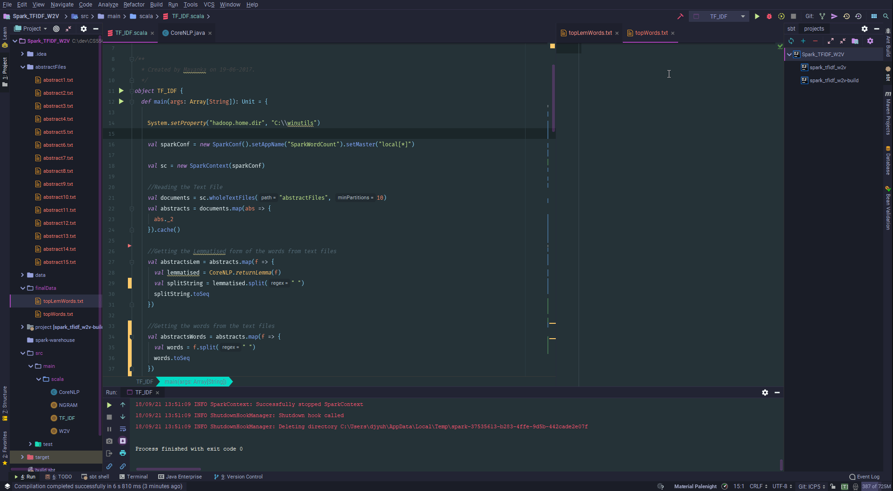

# KDM-ICP5

CS5560 Knowledge Discovery Management - In Class Programming 5

# Introduction

I will perform Term-Frequency (TF) and Inverse Document Frequency (IDF) on the retrieved documents from previous ICPs. The top 20 TF-IDF words of these documents will be found in three different methods: using the base words of the abstracts, the lemmatized words, and the n-grams of these words. Additionally, vectors of each of the three top 20 TF-IDF words will be found.

# Getting Top 20 Lemmatized Words and Words

To obtain the top 20 lemmatized words of the 15 abstracts, the abstracts were read in as whole text files using Spark. From here, the abstracts were obtained as an RDD. Each of these abstracts were mapped from the RDD and processed through the CoreNLP class using the returnLemma method. Once completed, the lemmatized abstracts were then put through the hashingTF class to obtain the TFs, following by a transform to create the IDFs.

The above process was repeated to obtain the top 20 Unlemmatized words.

# Getting Top 20 N-Gram

Like for the Top 20 Words and Lemmatized words, obtaining the N-Grams used a similar process. The abstracts were read in as whole text files using Spark. From here, the abstracts were obtained as an RDD. Each of these abstracts were mapped from the RDD and processed through the NGRAM object using the getNGrams method. Once completed, the N-Grams of the abstracts were then put through the hashingTF class to obtain the TFs, following by a transform to create the IDFs.

# Getting Top 20 TF-IDF Synonym Word Vectors

The second part of the ICP requires finding the synonyms of each of the top 20 TF-IDF from the first part of the ICP. The synonyms of these words are not synonyms in the sense of the words 'think' and 'ponder' being synonymous, but in the sense that "zero" is synonymous to "one", "two", "three" in the fact that they are numbers.

To do this, the abstracts were once again processed through Spark as whole text files to obtain an RDD[(String), (String)]. At this point, the RDD was processed out to find RDD[Seq[String]]'s for just the words, the lemmatizations of the words, and the ngrams of the words. These were then processed separately with their respective Top 20 TF-IDF word files.

# Data Output

The final data obtained for the ICP was stored in my Box in the [ICP5 folder](https://app.box.com/s/lkth75d0bqpixz6ybm4xmblppldygz99) with select access. This folder contains the Top20 TF-IDF text files, and the synonyms for each of the Top20 TF-IDF processes.

# Source Code

The source code for this ICP was provided by the class instructor Mayanka ChandraShekar: [mckw9@mail.umkc.edu](mckw9@mail.umkc.edu)